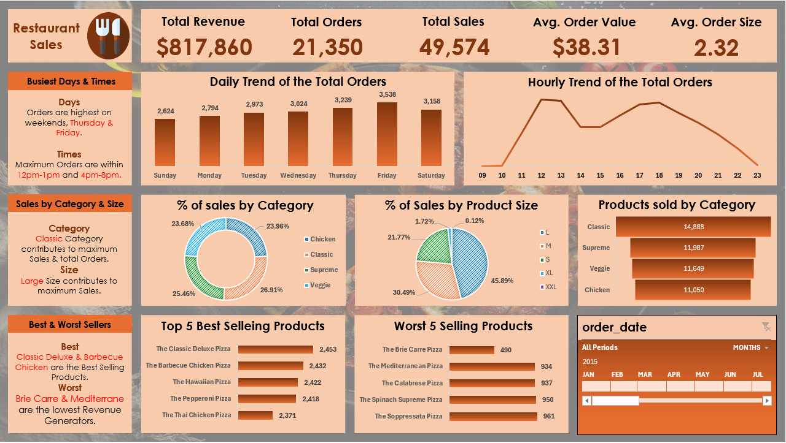

# 🍕 Restaurant Sales Analysis Dashboard

## 📌 Project Overview
This project involves data analysis of a restaurant's sales (specifically a Pizza restaurant) using **Microsoft Excel**. The goal is to transform raw transactional data into an interactive dashboard that provides actionable business insights regarding revenue generation, customer behavior, and menu performance.

## 📊 Dashboard Preview
 

## 💡 Key Business Insights
Based on the dashboard analysis, several key trends and metrics were identified:

* **Overall Performance (KPIs):** The restaurant generated **$817,860** in total revenue from **21,350** total orders, selling **49,574** items. The average order value sits at **$38.31**.
* **Peak Traffic (Days & Times):** Orders peak significantly on weekends, with **Thursday and Friday** being the busiest days. Daily rushes consistently occur during lunch (**12 PM - 1 PM**) and dinner (**4 PM - 8 PM**) hours.
* **Sales by Category & Size:** The **Classic** pizza category drives the maximum sales and total orders (approx 26.9%). Additionally, **Large (L)** sized pizzas contribute to the maximum sales volume (45.89%).
* **Product Performance:**
    * **Best Sellers:** *The Classic Deluxe Pizza* and *The Barbecue Chicken Pizza* are the top revenue generators.
    * **Worst Sellers:** *The Brie Carre Pizza* and *The Mediterranean Pizza* are underperforming and generate the lowest revenue.

## 🛠️ Tools & Techniques Used
* **Microsoft Excel:** The entire project was developed within Excel.
* **Data Cleaning & Processing:** Handling raw data, formatting, and preparing it for analysis.
* **Data Analysis:** Utilizing **Pivot Tables** to aggregate data and extract meaningful metrics.
* **Data Visualization:** Designing dynamic **Pivot Charts** (Bar charts, Line charts, Donut charts, and Funnel charts) to represent data visually.
* **Interactivity:** Implementing **Slicers/Timelines** (e.g., `order_date`) to allow users to filter data dynamically by specific months or periods.

## 🚀 How to Use This Project
1. Clone this repository or download the `.xlsx` file.
2. Open the file in Microsoft Excel.
3. Navigate to the **Dashboard** sheet.
4. Use the interactive timeline slicer at the bottom right to filter the sales data by specific months and observe how the KPIs and charts update dynamically.

---

## 🛡️ License

This project is licensed under the **MIT License**.  
You are free to use, modify, and share this project with proper attribution.

---

## 🌟 About Me

Hi! I'm **Abdelrahman Emara**, a **Data Analyst** aspiring to become a **Data Scientist**.  
My background is in **Telecommunication Engineering**, and I’m passionate about data pipelines, analytics, and transforming raw data into insights.

Let's connect! 👇

